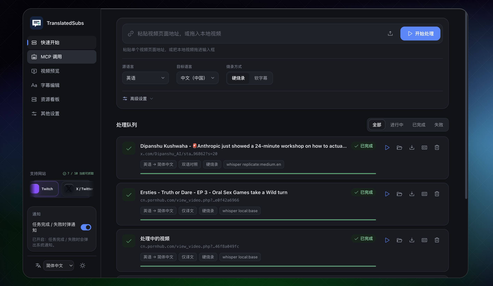
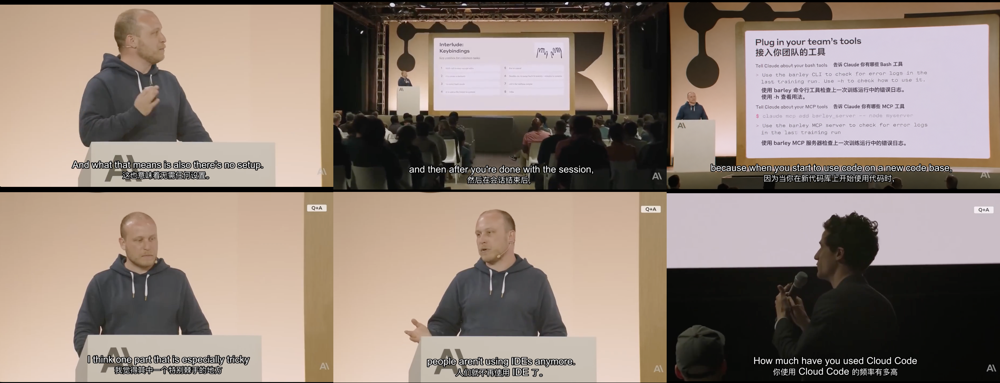

[English](../../README.md) | [简体中文](../zh/README.md) | [हिन्दी](../hi/README.md) | [Español](../es/README.md) | Français | [Português](../pt/README.md) | [Русский](../ru/README.md)

<div align="center">
  
  <h1>TranslatedSubs</h1>
  <p><strong>Comprenez la parole et le texte à l’écran : transcription, traduction des sous-titres et reconnaissance des contenus écrits au tableau.</strong></p>
  <p>Déploiement rapide avec intégration MCP.</p>
</div>

TranslatedSubs est un espace de travail pour comprendre les vidéos et les fichiers audio : téléchargement, transcription vocale, traduction des sous-titres et reconnaissance des textes écrits visibles dans les vidéos.

- **Vidéos de plusieurs sources** : téléchargez directement depuis les plateformes prises en charge, sans télécharger puis renvoyer les fichiers manuellement.
- **Déploiement local et modèles flexibles** : démarrez rapidement ou choisissez une configuration légère ; configurez des modèles plus avancés pour améliorer la correspondance, y compris des modèles communautaires.
- **Tâches parallèles et ressources visibles** : exécutez plusieurs tâches à la fois et consultez leur état ainsi que l’utilisation des ressources. La synchronisation Google Drive est également disponible.
- **Service dédié au réglage fin** : ajustez les modèles compatibles via un service distinct pour améliorer les résultats selon vos besoins.
- **Utilisation sur plusieurs appareils** : disponible sur le Web, Windows et macOS ; la prise en charge des mobiles est prévue pour l’avenir.

Plateformes vidéo prises en charge :
[](https://www.youtube.com/)
[](https://vimeo.com/)
[](https://www.dailymotion.com/)
[](https://www.twitch.tv/)
[](https://www.tiktok.com/)
[](https://x.com/)
[](https://www.instagram.com/)
[](https://www.acfun.cn/)
[](https://www.nicovideo.jp/)
[](https://www.pornhub.com/)





## Construire à partir des sources

### Compilation sur macOS

Pour exécuter le projet localement sur macOS, il faut Python 3.10–3.12, `uv` et FFmpeg avec la prise en charge de libass. L’API sert aussi l’interface Web ; aucune installation séparée de Node.js n’est nécessaire.

Exécutez ces commandes dans un répertoire approprié :

```sh
git clone https://github.com/S-zhi/TranslatedSubs.git
cd TranslatedSubs
brew install uv
brew tap homebrew-ffmpeg/ffmpeg
brew install ffmpeg-full
uv sync
cp .env.example .env
```

Vous pouvez ajouter à `.env` les clés d’API cloud nécessaires ou les configurer après le démarrage, ce qui est recommandé.

Démarrez l’API et l’interface Web :

```sh
uv run uvicorn src.handler.app:app --port 8000
```

Ouvrez <http://127.0.0.1:8000/>. Vérifiez le service et la présence du filtre de sous-titres incrustés dans FFmpeg avec :

```sh
curl http://127.0.0.1:8000/api/health
curl http://127.0.0.1:8000/api/health/ready
ffmpeg -hide_banner -filters | grep " subtitles "
```

### Compilation sur Windows

Sous Windows 10 ou 11, vous pouvez exécuter TranslatedSubs depuis les sources avec PowerShell. Le projet prend en charge Python 3.10–3.12 ; ces étapes utilisent Python 3.12 et installent les versions verrouillées dans `uv.lock`. L’API sert l’interface Web, donc Node.js n’a pas besoin d’être installé séparément.

1. Installez `uv` :

   ```powershell
   powershell -ExecutionPolicy ByPass -c "irm https://astral.sh/uv/install.ps1 | iex"
   ```

   Rouvrez PowerShell une fois l’installation terminée.

2. Installez FFmpeg. Sur la [page de téléchargement de FFmpeg](https://ffmpeg.org/download.html), choisissez une version Windows et téléchargez la version complète de Gyan. Décompressez-la et ajoutez son dossier `bin` (par exemple `C:\ffmpeg\bin`) à `PATH`, puis rouvrez PowerShell. Vérifiez la disponibilité de `ffmpeg`, `ffprobe` et du filtre de sous-titres incrustés :

   ```powershell
   ffprobe -version
   ffmpeg -hide_banner -filters | findstr /i subtitles
   ```

3. Clonez le projet, installez les dépendances et créez la configuration locale :

   ```powershell
   git clone https://github.com/S-zhi/TranslatedSubs.git
   cd TranslatedSubs
   uv python install 3.12
   uv sync --python 3.12 --locked
   Copy-Item .env.example .env
   ```

   Vous pouvez ajouter à `.env` les clés d’API cloud nécessaires ou les configurer après le démarrage, ce qui est recommandé.

Démarrez l’API et l’interface Web :

```powershell
uv run --locked uvicorn src.handler.app:app --host 127.0.0.1 --port 8000
```

Ouvrez <http://127.0.0.1:8000/>. Vérifiez le service avec :

```powershell
curl.exe http://127.0.0.1:8000/api/health
curl.exe http://127.0.0.1:8000/api/health/ready
```

## Démarrage rapide avec Docker

Exécutez ces commandes à la racine du dépôt :

```bash
cp .env.example .env
# Le traducteur local par défaut ne nécessite aucune clé API ; configurez une clé cloud seulement si nécessaire.
docker build -t translatedsubs:local . && docker run -d --name translatedsubs --restart unless-stopped -p 8000:8000 --env-file .env -e SUBTRANS_DATA_DIR=/data -e SUBTRANS_DB=/data/db/app.db -v translatedsubs-data:/data translatedsubs:local
```

Pour mettre à jour un conteneur existant, remplacez `translatedsubs-data` par le nom du volume actuel afin de conserver la base de données des tâches et les fichiers produits. Les variables d'environnement `SUBTRANS_*` restent prises en charge.

Ouvrez <http://localhost:8000/>. Exécutez `curl http://127.0.0.1:8000/api/health` pour vérifier que l'API répond ; la réponse normale contient `"ok":true`. `/api/health/ready` indique aussi l'état de la clé de traduction, de FFmpeg, du stockage et du filtre d'incrustation. Pour le développement local et le déploiement, consultez l'[index de la documentation (en chinois)](../README.md).

## Fonctionnalités

- **Chaîne de sous-titrage** : Télécharge des vidéos, extrait l'audio, transcrit et traduit la parole, puis produit des sous-titres séparés ou incrustés dans la vidéo.
- **Interface web** : Gère la file de tâches, affiche la progression, permet de prévisualiser les vidéos, de modifier les sous-titres et de télécharger les résultats.
- **Interface multilingue** : Choisissez depuis la barre latérale le chinois simplifié, l’anglais, l’hindi, l’espagnol, l’arabe, le français, le portugais ou le russe. Le choix est enregistré dans le navigateur ; lors de la première visite, la langue du navigateur est utilisée, sauf si le déploiement en définit une par défaut. Celle-ci se configure avec `UI_LOCALE` dans `web/config.js`.
- **Intégration MCP** : Permet à Codex, Claude Desktop et d'autres clients IA de créer et de suivre des tâches en langage naturel.
- **Extension Google Drive** : Téléverse, télécharge et organise les fichiers par tâche pour partager les résultats au sein d'une équipe.
- **Moteurs de transcription interchangeables** : Choisissez entre faster-whisper en local, Replicate et un service HTTP compatible selon vos besoins de coût, de rapidité et de confidentialité.

## De la vidéo aux sous-titres

1. Collez l'URL d'une page vidéo dans l'interface web ou téléversez une vidéo locale. Le test de téléchargement permet de vérifier l'URL au préalable.
2. Choisissez les langues source et cible, des sous-titres traduits seuls ou bilingues, puis des sous-titres séparés ou incrustés. La transcription utilise faster-whisper en local par défaut. Avant la première tâche, téléchargez le modèle choisi dans les paramètres des modèles locaux et attendez qu'il soit prêt.
3. Lancez la tâche et suivez le téléchargement, l'extraction audio, la transcription, la traduction et l'intégration dans la file. Ensuite, prévisualisez la vidéo, corrigez les sous-titres, relancez l'intégration et téléchargez la vidéo et le SRT. Le mode « téléchargement seul » ne crée pas de sous-titres.

Les sous-titres séparés peuvent être activés dans le lecteur. Les sous-titres incrustés sont gravés dans l'image et nécessitent le filtre `subtitles` (libass) de FFmpeg. Le premier traitement peut demander un téléchargement de modèle et l'accès à des services externes. Les clients IA peuvent emprunter le même parcours grâce au [guide des agents MCP (en chinois)](../mcp-agent-guide.md).

## Configuration et données

Copiez `.env.example` et démarrez sans clé API. Le traducteur par défaut est local, sur CPU, de l'anglais vers le chinois simplifié ; installez ses dépendances avec `uv sync --extra local-translation`, puis téléchargez le modèle depuis les paramètres. Renseignez `SUBTRANS_DEEPSEEK_API_KEY` uniquement si vous choisissez DeepSeek. Le [modèle de variables d'environnement](../../.env.example) recense tous les réglages et leurs valeurs par défaut. Les principaux sont :

| Réglage | Usage |
| --- | --- |
| `SUBTRANS_DEEPSEEK_API_KEY` | Clé DeepSeek facultative pour le chemin cloud de compatibilité explicite. |
| `SUBTRANS_DATA_DIR`, `SUBTRANS_DB` | Emplacement des fichiers et de la base SQLite des tâches ; l'exemple Docker les conserve dans un volume persistant. |
| `SUBTRANS_TRANSCRIBER_BACKEND` | Valeur par défaut : `local_whisper` ; choisissez explicitement `replicate` ou un service HTTP compatible si nécessaire. |
| `SUBTRANS_COOKIES` | Fichier de cookies pour les sites imposant une connexion ou une vérification de l'âge. |
| `SUBTRANS_WORKERS`, `SUBTRANS_DOWNLOAD_WORKERS` | Limites de parallélisme du traitement et des téléchargements. |

Réutilisez le volume existant lors d'une mise à jour ; conservez la base SQLite avec les résultats. Ne publiez pas `.env`, les cookies, les identifiants OAuth ni les médias créés par les tests. Google Drive nécessite un sidecar distinct ; voir le [démarrage rapide local (en chinois)](../local-quick-start.md).

## Problèmes fréquents

- L'API répond, mais les tâches ne démarrent pas : inspectez `checks` et `capabilities` dans `/api/health/ready` pour la clé, FFmpeg/FFprobe, yt-dlp et le stockage.
- `MODEL_NOT_READY` : téléchargez et vérifiez le modèle Whisper sélectionné dans les paramètres des modèles locaux.
- Les sous-titres incrustés ne fonctionnent pas : installez FFmpeg avec libass ou choisissez des sous-titres séparés. Vérifiez le filtre avec `ffmpeg -hide_banner -filters | grep ' subtitles '`.
- L'URL ne peut pas être téléchargée : lancez d'abord le test de téléchargement ; si une connexion est requise, configurez `SUBTRANS_COOKIES` selon le [guide local (en chinois)](../local-quick-start.md).

## Documentation

La plupart des guides suivants sont en chinois ; le protocole du service de transcription est en anglais.

- [Index de la documentation](../README.md) : guides de déploiement et d'extension par usage.
- [Démarrage rapide en local](../local-quick-start.md) : macOS/Linux, variables d'environnement et Google Drive sidecar.
- [Déploiement sous Linux](../quick-start-linux.md) : installation sur Ubuntu/Debian, systemd, proxy inverse et dépannage.
- [Serveur MCP](../mcp-server.md) : stdio, Streamable HTTP et outils.
- [Guide des agents MCP](../mcp-agent-guide.md) : ordre des appels, états et erreurs.
- [Protocole du service de transcription (en anglais)](../transcriber-service.md) : moteurs local, Replicate et HTTP.
- [Google Drive sidecar](../../drive-service/README.md) : API et configuration de la synchronisation des fichiers.

## Développement

Le projet utilise Python 3.10–3.12, FastAPI, FFmpeg et du JavaScript natif. Pour développer en local, lancez `uv sync`, puis `uv run uvicorn src.handler.app:app --port 8000` ; le même service héberge l'interface web. Lancez les tests Python avec `uv run pytest -q` et les tests frontend avec `npm test` depuis `web/`. Les tests utilisant des services réels doivent être activés explicitement ; voir [AGENTS.md (en chinois)](../../AGENTS.md).

`src/handler/` sert l'API HTTP ; `src/core/` traite les téléchargements, la transcription et les sous-titres ; `src/service/` et `src/store/` gèrent les tâches et les données ; `src/mcp_server/` fournit MCP ; `web/` contient l'interface. Consultez [CONTRIBUTING.md (en chinois)](../../.github/CONTRIBUTING.md). Signalez les problèmes de sécurité en privé selon [SECURITY.md](../../.github/SECURITY.md), jamais dans une issue publique.

## Licence et conformité

Le projet est publié sous [licence MIT](../../LICENSE). Ne traitez que des contenus que vous êtes autorisé à consulter, télécharger, transcrire, traduire et redistribuer. Respectez les conditions des sites sources, les droits d'auteur et les lois applicables.
